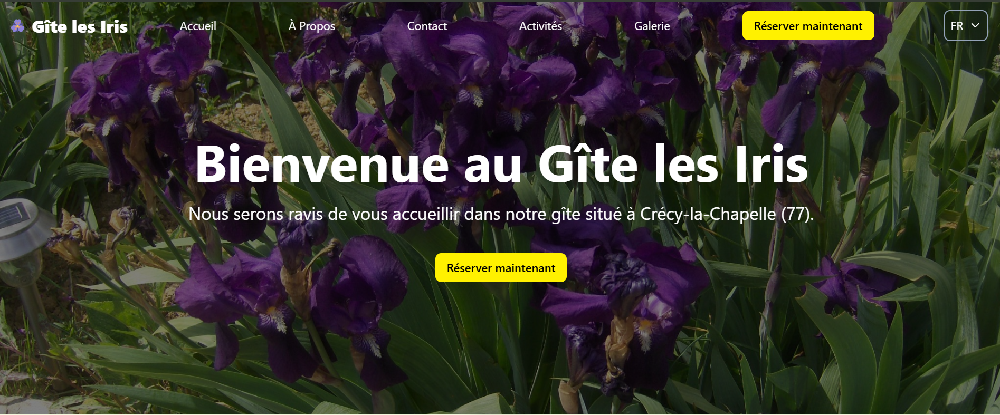

# Gîte les Iris

This project is a showcase website developed using React, TypeScript, and Tailwind CSS. It is designed to be fast, responsive, and easily extendable, providing a modern and sleek user interface.

[](https://gite-les-iris.vercel.app/)

## Demo

You can view the site [here](https://gite-les-iris.vercel.app/)

## Features

- Responsive Design: Adapts to different devices (desktop, tablet, mobile).
- Modern and Clean Layout: Created with Tailwind CSS for quick and efficient styling.
- Optimized Performance: Fast load times with efficient resource management.
- Modular Structure: Reusable TypeScript components for easier maintenance.

## Technologies Used

- React - JavaScript library for building the user interface
- TypeScript - Superset of JavaScript enabling static typing
- Tailwind CSS - CSS framework for rapid, responsive design
- EmailJS

## Installation

1. Clone the repository :

```bash
git clone https://github.com/Miracuchi/gite-les-iris.git
cd gite-les-iris
```

2. Install dependencies:

```bash
yanr install
```

3. Set your .env

For this project, I used EmailJS and Google Captcha

- VITE_SERVICE_EMAIL_ID=""
- VITE_USER_EMAIL_ID=""
- VITE_TEMPLATE_EMAIL_ID=""
- VITE_PUBLIC_CAPTCHA_API_KEY=""

4. Start the development server:

```bash
yarn run dev
```
